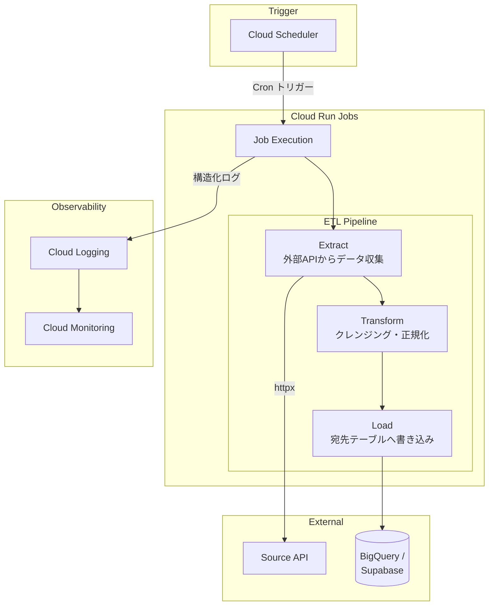
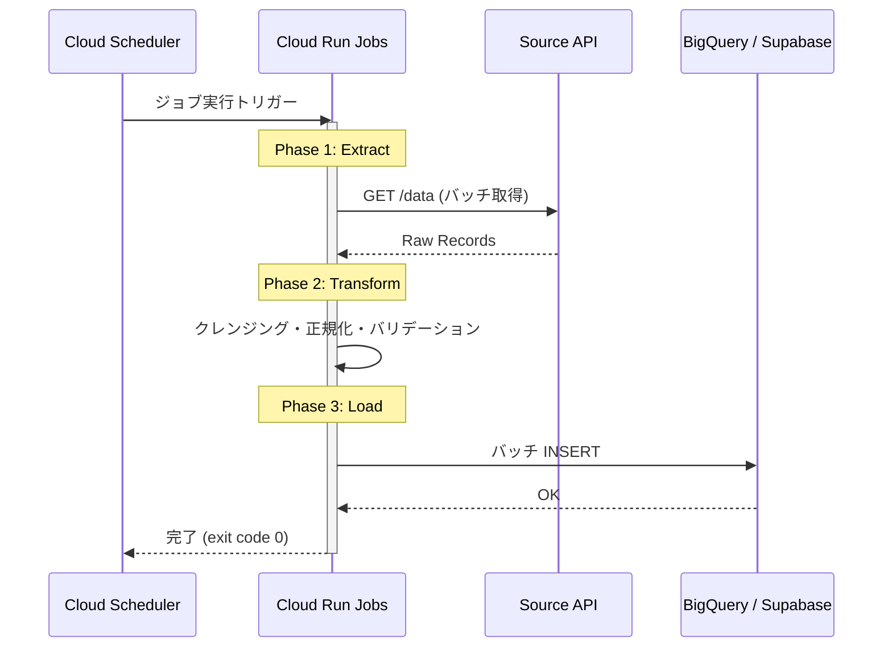

# Cloud Run Jobs データパイプライン

FastAPI + Cloud Run Jobs によるバッチ ETL パイプラインのデモ実装。

## Why この設計にしたか

### Cloud Run Jobs を選んだ理由

- **コスト効率**: バッチ実行時のみ課金される。常時稼働の VM と比べてコストが桁違いに安い
- **スケーラビリティ**: タスク並列度を設定するだけで水平スケール可能
- **運用負荷の低減**: インフラ管理不要。コンテナを渡すだけでジョブが走る
- **Cloud Scheduler との統合**: Cron 式でスケジュール実行が可能

### ETL の3段階分離

Extract / Transform / Load を明確に分離した理由:

1. **障害の局所化**: どの段階で失敗したかが即座に分かる
2. **リトライの粒度制御**: Load だけ失敗した場合、Transform 結果を再利用できる
3. **テスト容易性**: 各段階を独立してユニットテスト可能

### マルチステージ Docker ビルド

- ビルド時依存をランタイムに持ち込まないことで、イメージサイズを削減
- コールドスタート時間の短縮に直結する

## アーキテクチャ



## パイプラインフロー



## ディレクトリ構成

```
data-pipeline/
├── src/
│   ├── main.py          # エントリポイント（FastAPI + CLI）
│   └── pipeline.py      # ETL パイプラインロジック
├── Dockerfile           # マルチステージビルド
├── cloudbuild.yaml      # Cloud Build 設定
├── requirements.txt     # Python 依存関係
└── README.md
```

## ローカル実行

```bash
# 依存関係インストール
pip install -r requirements.txt

# ドライラン（DB書き込みなし）
DRY_RUN=true python src/main.py

# FastAPI サーバーとして起動（デバッグ用）
uvicorn src.main:app --reload --port 8080
```

## デプロイ

```bash
# Cloud Build でビルド & デプロイ
gcloud builds submit --config=cloudbuild.yaml \
  --substitutions=_PROJECT_ID=your-project-id

# ジョブの手動実行
gcloud run jobs execute data-pipeline --region=asia-northeast1

# スケジュール設定（毎日 AM 3:00 JST）
gcloud scheduler jobs create http data-pipeline-schedule \
  --schedule="0 18 * * *" \
  --uri="https://asia-northeast1-run.googleapis.com/..." \
  --http-method=POST
```

> NOTE: 上記のプロジェクトID・URLはプレースホルダーです。実際の値は非公開です。
