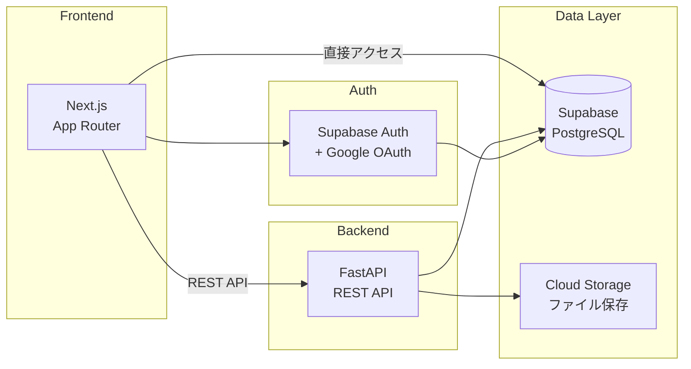

# フルスタック SaaS アーキテクチャ

Next.js + FastAPI + Supabase によるフルスタック SaaS のアーキテクチャ設計ドキュメント。

## Why この設計にしたか

### 技術スタック選定の理由

| 技術 | 選定理由 |
|------|---------|
| **Next.js (App Router)** | RSC による初期表示高速化、SEO 対応、Vercel との親和性 |
| **FastAPI** | Python エコシステムの活用（ML/データ処理）、型安全な API、非同期処理 |
| **Supabase** | PostgreSQL ベースで学習コストが低い、Row Level Security、リアルタイム機能 |

### フロントエンドとバックエンドを分離した理由

1. **チームスケーラビリティ**: フロントエンド/バックエンドで独立した開発サイクルが可能
2. **技術選択の自由度**: フロントは TypeScript、バックは Python と最適な言語を選択
3. **デプロイの独立性**: 片方の変更がもう片方に影響しない

### Supabase を選んだ理由（Firebase との比較）

- PostgreSQL ベースなので SQL の知識がそのまま使える
- Row Level Security により、アプリ層ではなく DB 層でアクセス制御が可能
- オープンソースのためベンダーロックインリスクが低い

## アーキテクチャ概要

詳細な設計図は [architecture.md](./architecture.md) を参照。



## ディレクトリ構成

```
fullstack-saas/
├── README.md            # 本ファイル（概要）
└── architecture.md      # 詳細設計図・シーケンス図・ADR
```
