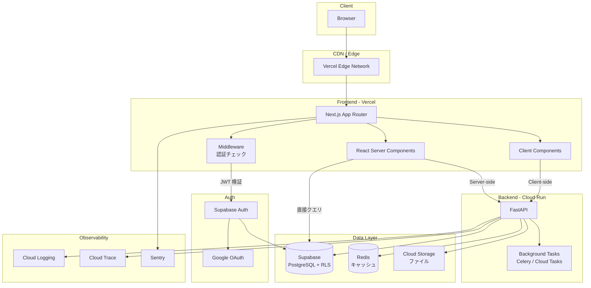
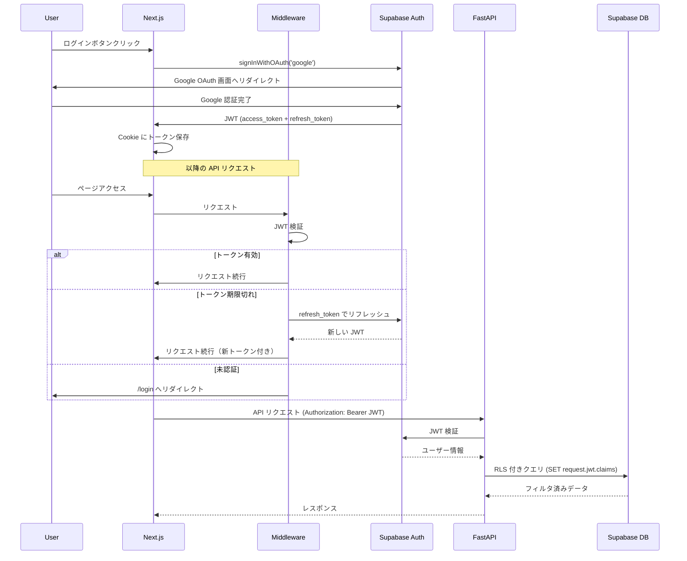
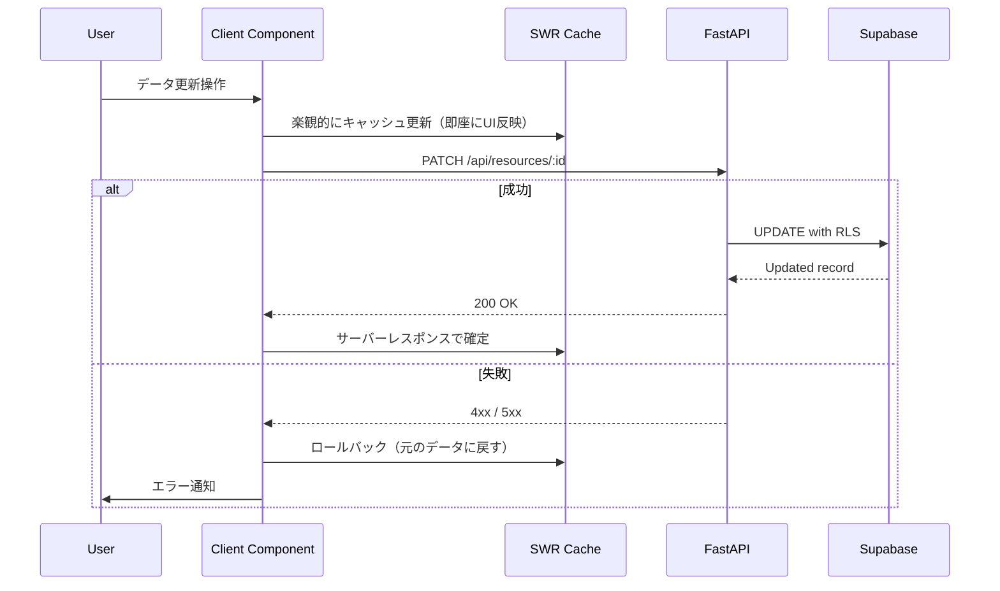

# アーキテクチャ設計書

## 全体構成図

## 認証フロー

## データ更新フロー（楽観的更新）

## ADR (Architecture Decision Records)

### ADR-001: BFF を置かず Next.js から FastAPI を直接呼ぶ

- **Status**: Accepted
- **Context**: Next.js の API Routes を BFF (Backend for Frontend) として使うか、FastAPI を直接呼ぶか
- **Decision**: BFF を置かず、Next.js (RSC) から FastAPI を直接呼ぶ
- **Rationale**:
  - BFF を挟むとレイテンシが増加する
  - RSC のサーバーサイドから直接呼べば、BFF と同等のセキュリティを確保できる
  - API Routes を BFF にすると、ロジックの二重管理になりやすい
- **Consequences**:
  - CORS 設定が必要（開発環境のみ。本番は同一ドメインで配信）
  - フロントエンドが API のスキーマに直接依存する

### ADR-002: Supabase RLS をメインのアクセス制御とする

- **Status**: Accepted
- **Context**: アクセス制御をアプリケーション層 (FastAPI) で行うか、データベース層 (RLS) で行うか
- **Decision**: Row Level Security をメインのアクセス制御とし、アプリ層は補助的に使う
- **Rationale**:
  - RLS はどの経路からアクセスしても一貫したアクセス制御を保証する
  - アプリ層だけだと、新しいエンドポイント追加時にチェック漏れのリスクがある
  - Supabase Client から直接クエリする場合も、RLS が自動適用される
- **Consequences**:
  - RLS ポリシーの複雑化に注意が必要
  - マイグレーション時に RLS ポリシーも管理対象になる
  - デバッグが難しくなる場合がある（クエリは成功するが結果が空になる）

### ADR-003: RSC と Client Components の使い分け基準

- **Status**: Accepted
- **Context**: Next.js App Router でどのコンポーネントを RSC / Client Component にするか
- **Decision**: 以下の基準で分類する
  - **RSC**: データフェッチ、SEO が必要なコンテンツ、静的なUI
  - **Client Component**: ユーザーインタラクション、リアルタイム更新、ブラウザ API 利用
- **Rationale**:
  - RSC はバンドルサイズに含まれないため、初期表示が高速
  - インタラクションが必要な部分だけ Client Component にすることで、最適なバランスを取れる
- **Consequences**:
  - コンポーネント設計時に「この機能は RSC で十分か」を常に検討する必要がある
  - props のシリアライズ制約を理解する必要がある

### ADR-004: エラーハンドリング戦略

- **Status**: Accepted
- **Context**: フロントエンド・バックエンド間のエラーハンドリング方針
- **Decision**: 構造化エラーレスポンス + フロントエンド Error Boundary の二重防御
- **Rationale**:
  - API は RFC 7807 (Problem Details) 形式で一貫したエラーレスポンスを返す
  - フロントエンドは Error Boundary でクラッシュを防ぎ、ユーザーフレンドリーなフォールバックを表示
  - 予期しないエラーは Sentry に送信し、可視化する
- **Consequences**:
  - エラー型の定義が共有ライブラリとして必要になる
  - Error Boundary のテストが必要
