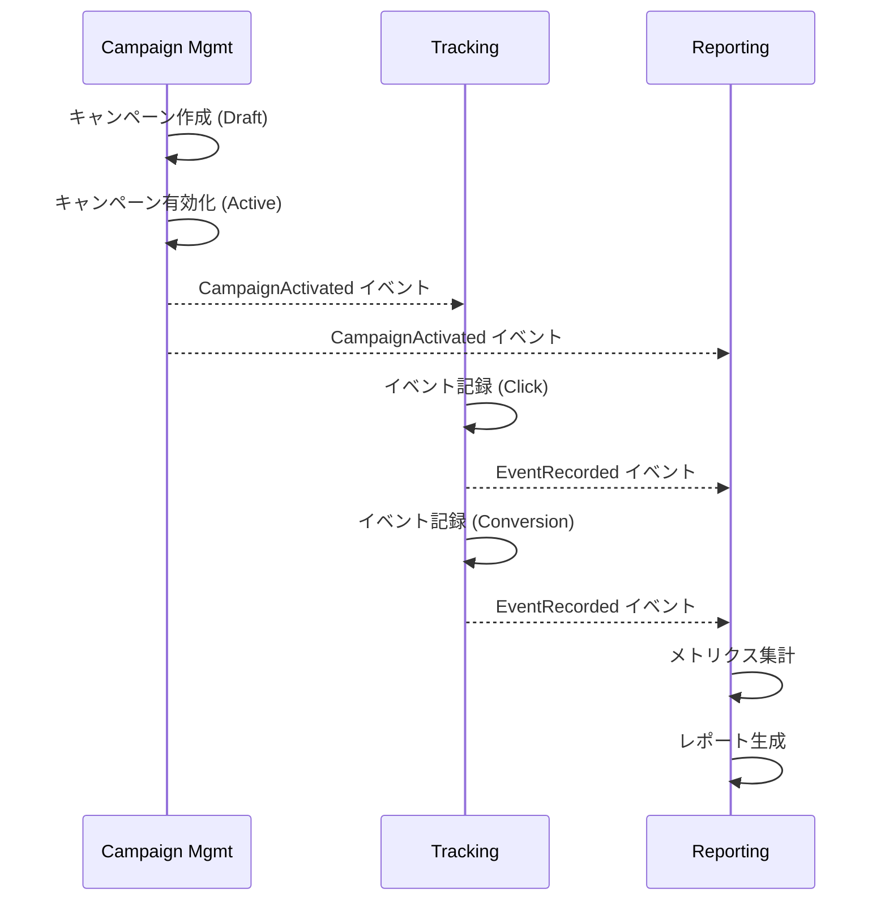

# 境界づけられたコンテキスト

各境界コンテキストの責務、所有するモデル、および連携パターンを定義します。

## Why 境界コンテキストを分けるのか

1つのモデルであらゆる概念を表現しようとすると、モデルが矛盾を抱えて肥大化します（Big Ball of Mud）。たとえば「Campaign」という概念は、管理側では「予算・期間の設定」、トラッキング側では「イベントの紐づけ先」、レポート側では「集計の軸」と、コンテキストごとに意味が異なります。

境界コンテキストを分けることで:
- 各チームが独立してモデルを進化させられる
- 変更の影響範囲が局所化される
- マイクロサービスへの分割境界が自然に決まる

---

## 1. Campaign Management（キャンペーン管理）

### 責務
- キャンペーンの CRUD（作成・読取・更新・削除）
- キャンペーン状態のライフサイクル管理（Draft → Active → Paused → Completed）
- 予算の設定と消化状況の追跡

### 所有モデル
- **Campaign**（集約ルート）: キャンペーンのライフサイクルを管理
- **CampaignId, CampaignName, Money, DateRange, CampaignStatus**（値オブジェクト）

### 発行するドメインイベント
- `CampaignCreated` — キャンペーン作成時
- `CampaignActivated` — キャンペーン有効化時
- `CampaignCompleted` — キャンペーン完了時

### 連携
| 相手 | パターン | 方向 | 説明 |
|------|----------|------|------|
| Tracking | Published Language | 上流 | キャンペーン定義を共有言語として公開 |
| Reporting | Domain Events | 上流 | 状態変更をイベント通知 |
| Authentication | OHS + ACL | 下流 | 認証トークンを ACL で翻訳して利用 |
| Billing | Conformist | 下流 | 課金モデルに準拠 |

---

## 2. Tracking（トラッキング）

### 責務
- ユーザー行動イベントの記録（クリック、インプレッション、コンバージョン）
- 外部広告プラットフォームからのデータ取り込み
- イベントのバリデーションと正規化

### 所有モデル
- **TrackingEvent**（エンティティ）: 1件のユーザー行動記録
- **EventId, EventType**（値オブジェクト）

### 発行するドメインイベント
- `EventRecorded` — トラッキングイベント記録時

### 連携
| 相手 | パターン | 方向 | 説明 |
|------|----------|------|------|
| Campaign Management | Published Language | 下流 | キャンペーンIDを参照 |
| Reporting | Domain Events | 上流 | イベント記録を非同期通知 |
| Ad Platforms | ACL | 下流 | 外部APIの差異を吸収 |
| Authentication | OHS + ACL | 下流 | 認証を利用 |

---

## 3. Reporting（レポーティング）

### 責務
- トラッキングイベントの集計
- メトリクス（CTR, CVR 等）の算出
- レポートの生成と保存

### 所有モデル
- **Report**（エンティティ）: 集計結果
- **Metrics**（値オブジェクト）: 各種計測指標

### 連携
| 相手 | パターン | 方向 | 説明 |
|------|----------|------|------|
| Tracking | Domain Events | 下流 | イベントデータを受信して集計 |
| Campaign Management | Domain Events | 下流 | キャンペーン状態を受信 |
| Analytics (外部) | ACL | 下流 | 外部分析ツールとの統合 |
| Authentication | OHS + ACL | 下流 | 認証を利用 |

---

## 4. Authentication（認証・認可）

### 責務
- ユーザー認証（ログイン、トークン発行）
- 認可（ロールベースアクセス制御）
- セッション管理

### 連携パターン
他の全コンテキストに対して **Open Host Service（OHS）** として認証 API を提供します。各コンテキストは **ACL（腐敗防止層）** を通じて認証情報を自コンテキストのモデルに変換します。

---

## 5. Billing（課金）

### 責務
- 利用量に基づく課金計算
- プラン管理（Free / Pro / Enterprise）
- 請求書発行

### 連携パターン
Campaign Management は課金プランの制約（キャンペーン上限数、予算上限等）に **Conformist** パターンで準拠します。課金モデルの変更は Campaign Management 側が追従する設計です。

---

## コンテキスト間のデータフロー

