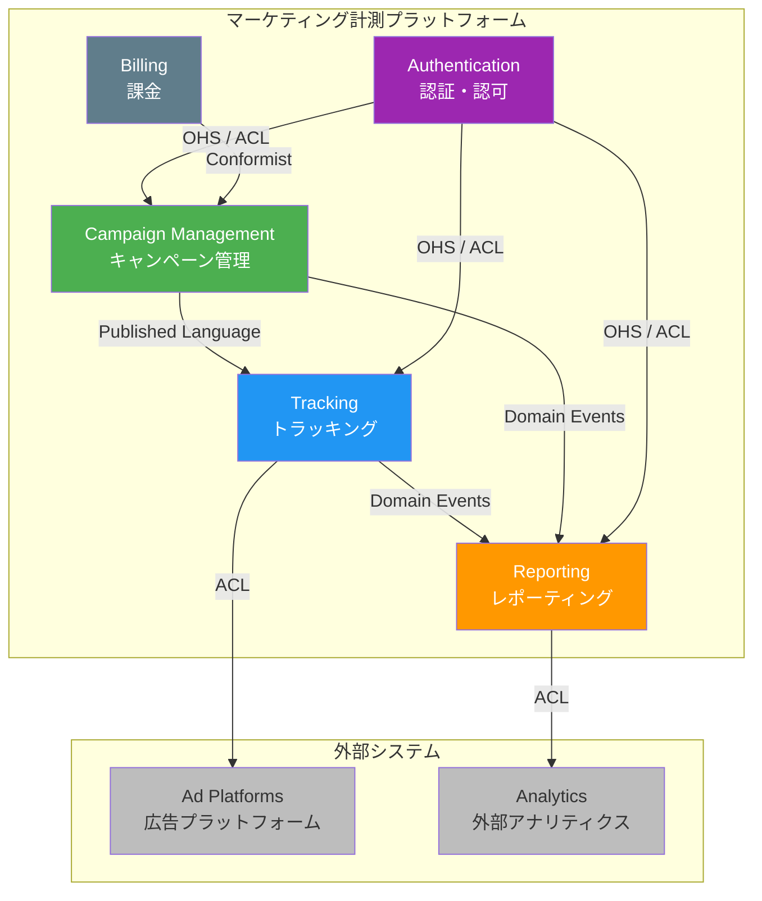

# コンテキストマップ

マーケティング計測プラットフォームにおける境界づけられたコンテキストの全体像を示します。

## Why コンテキストマップを作るのか

コンテキストマップは、システム全体の境界コンテキスト間の関係を可視化するためのツールです。これにより:

- チーム間の依存関係と影響範囲が明確になる
- 連携パターン（ACL, OHS, Shared Kernel 等）の選択根拠が残る
- 新メンバーがシステム全体を素早く理解できる

## コンテキストマップ図

## コンテキスト間の関係パターン

| 上流 | 下流 | パターン | 理由 |
|------|------|----------|------|
| Campaign Management | Tracking | Published Language | キャンペーン定義を共有言語として公開 |
| Tracking | Reporting | Domain Events | イベント発生を非同期で通知、疎結合を維持 |
| Campaign Management | Reporting | Domain Events | キャンペーン状態変更を通知 |
| Authentication | 各コンテキスト | OHS + ACL | 認証は共通サービスだが、各コンテキストは ACL で翻訳 |
| Billing | Campaign Management | Conformist | 課金モデルに合わせてキャンペーン管理が準拠 |
| Tracking | Ad Platforms | ACL | 外部 API の変更から内部モデルを保護 |
| Reporting | Analytics | ACL | 外部分析ツールとの統合を腐敗防止層で隔離 |

## パターン選択の判断基準

- **Published Language**: 複数コンテキストが参照する安定した概念がある場合
- **Domain Events**: コンテキスト間を疎結合に保ちたい場合（推奨デフォルト）
- **ACL（腐敗防止層）**: 外部システムや異なるモデルとの統合時
- **OHS（公開ホストサービス）**: 汎用的な API を提供する場合
- **Conformist**: 上流の変更に追従するコストが低い場合
