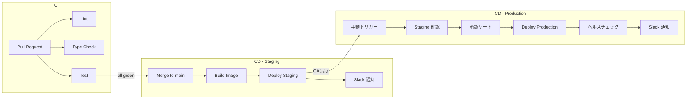

# 08: CI/CD Pipeline

GitHub Actions + Docker + Cloud Run によるCI/CDパイプラインのデモ実装。

## Why この設計にしたか

### GitHub Actions を選んだ理由

- **GitHub との統合**: リポジトリと同じプラットフォームで CI/CD が完結する
- **Marketplace**: 豊富なアクションエコシステム
- **Workload Identity Federation**: GCP との認証にサービスアカウントキーが不要

### 3つのワークフローに分離した理由

| ワークフロー | トリガー | 理由 |
|-------------|---------|------|
| **CI** | PR + push | コード品質は全ての変更で自動チェック |
| **Staging Deploy** | main push | main マージ = ステージングデプロイ可能 |
| **Production Deploy** | 手動 + 承認 | 本番デプロイは意図的なアクション |

1. **CI と CD の関心分離**: テストの失敗がデプロイに影響しない（別ワークフロー）
2. **環境ごとのセキュリティ**: 本番は承認ゲートを必須にできる
3. **ロールバックの容易性**: イメージタグ指定で任意のバージョンにデプロイ可能

## CI/CD 設計思想



## 環境分離戦略

| 項目 | Staging | Production |
|------|---------|-----------|
| **デプロイトリガー** | main push (自動) | 手動 + 承認 |
| **インスタンス数** | 0-5 (スケールtoゼロ) | 1-20 (最低1台常駐) |
| **メモリ / CPU** | 512Mi / 1 CPU | 1Gi / 2 CPU |
| **認証** | 公開 (社内QA用) | 認証必須 |
| **環境変数** | `ENVIRONMENT=staging` | `ENVIRONMENT=production` |
| **DB** | ステージング DB | 本番 DB (RLS 有効) |

### Why スケール to ゼロ（Staging）

ステージングはQA時のみ使うため、アクセスがない時間帯はインスタンスを0にしてコスト削減。
本番は最低1台を常駐させ、コールドスタートによるレイテンシ悪化を防ぐ。

## シークレット管理方針

### 原則

1. **コードにシークレットを含めない**: 環境変数または Secret Manager 経由で注入
2. **GitHub Secrets を使い分ける**: リポジトリ Secrets と Environment Secrets を分離
3. **サービスアカウントキーを使わない**: Workload Identity Federation で OIDC 認証

### GitHub Secrets の分類

```
Repository Secrets (共通)
├── GCP_PROJECT_ID
├── WIF_PROVIDER          # Workload Identity Federation プロバイダー
├── WIF_SERVICE_ACCOUNT   # サービスアカウント
└── SLACK_WEBHOOK_URL

Environment Secrets (環境別)
├── staging/
│   └── STAGING_URL
└── production/
    ├── PRODUCTION_URL
    └── (承認者設定は Environment Protection Rules で管理)
```

### Why Workload Identity Federation

- サービスアカウントキーの漏洩リスクがゼロ
- キーのローテーション管理が不要
- GitHub の OIDC トークンで直接 GCP リソースにアクセス

## ディレクトリ構成

```
08-ci-cd-pipeline/
├── .github/
│   └── workflows/
│       ├── ci.yml              # テスト・リント・型チェック
│       ├── deploy-staging.yml  # ステージングデプロイ
│       └── deploy-prod.yml     # 本番デプロイ（承認ゲート付き）
├── Dockerfile                  # マルチステージビルド
├── docker-compose.yml          # ローカル開発環境
├── scripts/
│   └── deploy.sh               # デプロイスクリプト
└── README.md
```

## Docker

### マルチステージビルド

ビルドステージとランタイムステージを分離し:
- イメージサイズを最小化（数百MB → 100MB以下）
- 攻撃対象面（attack surface）を削減
- Cloud Run のコールドスタート時間を短縮

### ローカル開発環境

`docker-compose.yml` で app + PostgreSQL + Redis の開発環境を一発起動:

```bash
docker compose up -d
```

## デプロイスクリプト

`scripts/deploy.sh` で staging / production を環境変数で切り替え:

```bash
# ステージングデプロイ
ENVIRONMENT=staging ./scripts/deploy.sh

# 本番デプロイ
ENVIRONMENT=production ./scripts/deploy.sh
```
