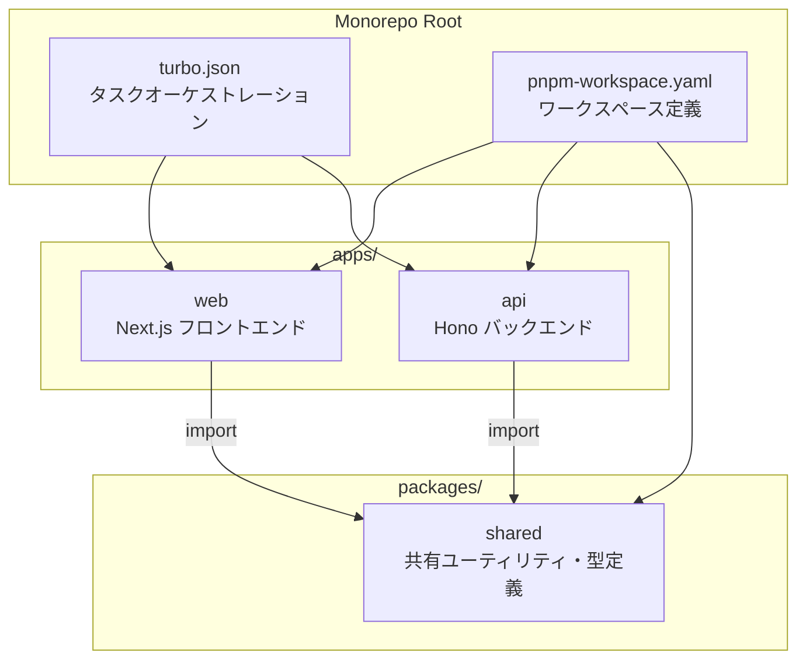
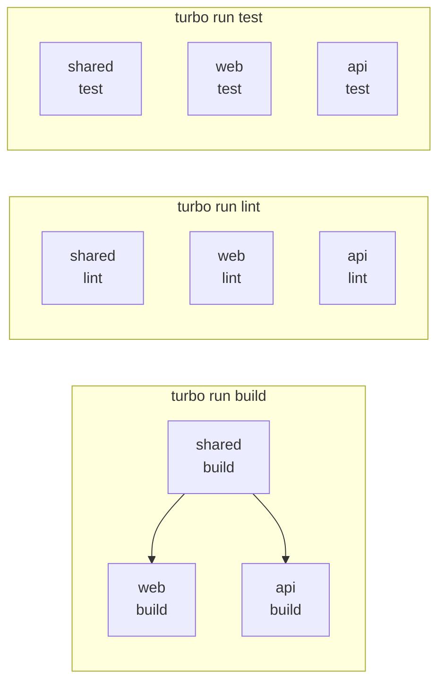

# 09: Monorepo Design

Turborepo + pnpm workspace によるモノレポ構成のデモ実装。

## Why モノレポにしたか

### モノレポ採用の判断基準

以下の条件が揃った場合にモノレポを採用する:

1. **コード共有が頻繁**: フロントエンドとバックエンドで型定義・バリデーション・ユーティリティを共有
2. **チーム規模が適切**: 2-15人程度。これ以上大きいと専用のモノレポ基盤チームが必要
3. **リリースサイクルが連動**: フロント・バックの変更が同時にデプロイされることが多い
4. **ツールチェーンが統一可能**: TypeScript / Node.js で統一できる

### ポリレポとの比較

| 観点 | モノレポ | ポリレポ |
|------|---------|---------|
| コード共有 | import するだけ | npm パッケージとして publish が必要 |
| 型の一貫性 | コンパイル時に全体チェック | パッケージバージョンのずれリスク |
| CI/CD | 変更影響範囲のみビルド (Turbo) | リポジトリ単位でフルビルド |
| 依存関係管理 | 一元管理 (pnpm) | 各リポジトリで個別管理 |
| オンボーディング | 1つの clone で全体把握 | 複数リポジトリの関係理解が必要 |

### Why Turborepo + pnpm

- **Turborepo**: タスクの依存関係を理解して並列実行 + リモートキャッシュでCI高速化
- **pnpm**: 厳格な依存解決（幽霊依存なし）+ ディスク効率の良い node_modules

## アーキテクチャ



## タスクパイプライン



- `build`: 依存関係順に実行（shared -> apps）
- `lint` / `test`: 依存関係なし、全パッケージ並列実行

## ディレクトリ構成

```
09-monorepo-design/
├── README.md                # 本ファイル
├── turbo.json               # Turborepo 設定
├── pnpm-workspace.yaml      # pnpm ワークスペース定義
├── package.json             # ルート package.json
├── packages/
│   └── shared/              # 共有パッケージ
│       ├── src/
│       │   ├── index.ts     # エントリポイント
│       │   ├── utils.ts     # ユーティリティ関数
│       │   └── types.ts     # 共有型定義
│       ├── package.json
│       └── tsconfig.json
└── apps/
    ├── web/                 # Next.js フロントエンド
    │   ├── src/app/
    │   │   ├── page.tsx
    │   │   └── layout.tsx
    │   ├── package.json
    │   ├── tsconfig.json
    │   └── next.config.js
    └── api/                 # Hono バックエンド
        ├── src/
        │   ├── index.ts
        │   └── routes/
        │       └── health.ts
        ├── package.json
        └── tsconfig.json
```

## ローカル開発

```bash
# 依存関係のインストール
pnpm install

# 全パッケージのビルド
pnpm run build

# 全パッケージのリント
pnpm run lint

# 全パッケージのテスト
pnpm run test

# 開発サーバー起動（web + api 同時）
pnpm run dev
```

## Turborepo キャッシュ

Turborepo はタスクの入力（ソースコード、依存関係）をハッシュ化し、
出力をキャッシュする。同じ入力なら再ビルドをスキップする。

```bash
# キャッシュの確認
pnpm turbo run build --dry

# キャッシュの無効化（フルビルド）
pnpm turbo run build --force
```

リモートキャッシュ（Vercel Remote Cache）を有効にすると、
CI でのビルド時間を大幅に短縮できる。
