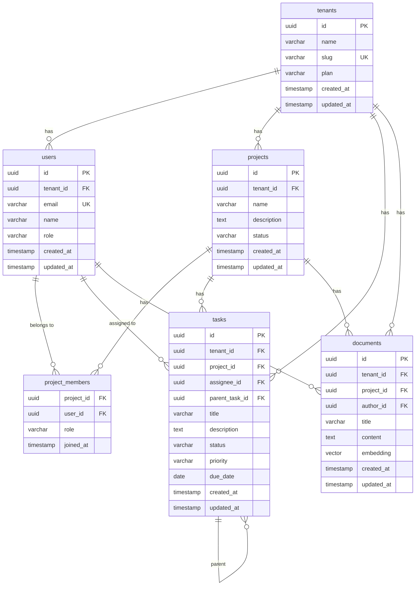

# ER図

マルチテナント SaaS のデータモデルを定義します。

## Why このテーブル構成にしたか

- `tenants` を独立テーブルとし、全テーブルに `tenant_id` を持たせることで RLS の基盤とする
- `users` はテナントに所属し、複数プロジェクトに参加できる（多対多）
- `tasks` はプロジェクト配下に階層構造を持ち、親タスク・子タスクを表現できる
- `documents` にベクトルカラムを持たせ、ナレッジベースの類似検索を可能にする

## ER図

## テーブル設計の補足

### tenants
- `slug`: URL フレンドリーなテナント識別子（例: `acme-corp`）
- `plan`: 料金プラン（`free`, `pro`, `enterprise`）

### users
- `role`: テナント内の役割（`owner`, `admin`, `member`）
- 1ユーザーは1テナントに所属（マルチテナント対応は招待制）

### tasks
- `parent_task_id`: 自己参照で階層タスクを実現
- `priority`: `low`, `medium`, `high`, `urgent`
- `status`: `todo`, `in_progress`, `done`, `cancelled`

### documents
- `embedding`: pgvector の `vector(1536)` 型。OpenAI text-embedding-ada-002 の次元数に合わせている
- ナレッジベース内の類似ドキュメント検索に使用
