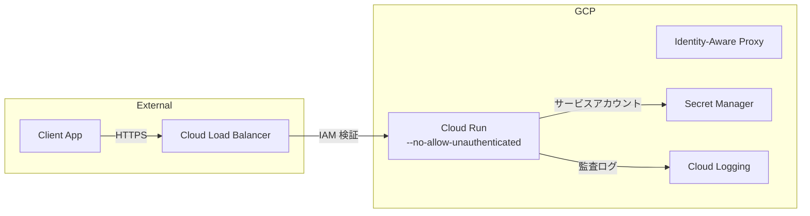

# Cloud Run 認証設定

## 概要

GCP Cloud Run 上で API を安全にホスティングするための認証設定。IAM ベースのアクセス制御とサービスアカウント設計を含む。

## Why Cloud Run の認証を多層にしたか

- **--no-allow-unauthenticated をデフォルトに**: 未認証アクセスをインフラレベルで遮断し、アプリケーションに到達する前にブロック
- **サービスアカウントの最小権限**: 各サービスに必要最小限の IAM ロールのみ付与し、侵害時の被害範囲を限定
- **多層防御**: Cloud Run IAM → ミドルウェア認証 → RBAC → RLS の 4 層で保護

## デプロイ設定

### 基本コマンド

```bash
gcloud run deploy my-api \
  --image gcr.io/my-project/my-api:latest \
  --region asia-northeast1 \
  --no-allow-unauthenticated \
  --service-account my-api-sa@my-project.iam.gserviceaccount.com \
  --set-env-vars "SUPABASE_URL=https://xxx.supabase.co,SUPABASE_JWT_SECRET=your-jwt-secret" \
  --set-secrets "SUPABASE_SERVICE_KEY=supabase-service-key:latest"
```

### 重要なフラグ

| フラグ | 説明 |
|-------|------|
| `--no-allow-unauthenticated` | IAM 認証を必須にする |
| `--service-account` | 専用のサービスアカウントを指定 |
| `--set-secrets` | Secret Manager からシークレットを注入 |
| `--ingress internal-and-cloud-load-balancing` | 内部トラフィック + LB 経由のみ許可 |

## IAM 設計

### サービスアカウント構成

```
my-project/
├── my-api-sa@...              # API サービス用
│   ├── roles/secretmanager.secretAccessor  # Secret Manager 読み取り
│   ├── roles/cloudsql.client              # Cloud SQL 接続（使用時）
│   └── roles/logging.logWriter            # Cloud Logging 書き込み
│
├── my-batch-sa@...            # バッチ処理用
│   ├── roles/storage.objectViewer         # Cloud Storage 読み取り
│   └── roles/bigquery.dataEditor          # BigQuery 書き込み
│
└── my-scheduler-sa@...        # Cloud Scheduler → Cloud Run 呼び出し用
    └── roles/run.invoker                  # Cloud Run 起動権限
```

### アクセスパターン



## 公開エンドポイントのパターン

一部のエンドポイント（ヘルスチェック、Webhook 受信等）を公開する場合:

### パターン A: 別サービスとしてデプロイ

```bash
# 公開 API（ヘルスチェック、Webhook）
gcloud run deploy my-api-public \
  --allow-unauthenticated \
  --ingress all

# 認証必須 API（メイン API）
gcloud run deploy my-api \
  --no-allow-unauthenticated \
  --ingress internal-and-cloud-load-balancing
```

### パターン B: アプリケーション層で制御

```typescript
// ヘルスチェックは認証スキップ
app.get('/health', (c) => c.json({ status: 'ok' }));

// その他は認証必須
app.use('/api/*', authMiddleware());
```

## シークレット管理

### Secret Manager の使用

```bash
# シークレットの作成
echo -n "your-secret-value" | \
  gcloud secrets create supabase-service-key \
  --data-file=-

# Cloud Run にマウント
gcloud run deploy my-api \
  --set-secrets "SUPABASE_SERVICE_KEY=supabase-service-key:latest"
```

### 環境変数 vs Secret Manager

| 項目 | 環境変数 (--set-env-vars) | Secret Manager (--set-secrets) |
|------|-------------------------|-------------------------------|
| 用途 | 非機密設定値 | API キー、DB パスワード等 |
| 暗号化 | なし | KMS で暗号化 |
| ローテーション | 再デプロイ必要 | バージョン管理で可能 |
| 監査 | なし | アクセスログ記録 |

## 監査ログ

Cloud Run の全リクエストは自動的に Cloud Logging に記録される:

```json
{
  "httpRequest": {
    "requestMethod": "POST",
    "requestUrl": "/api/items",
    "status": 201,
    "userAgent": "...",
    "remoteIp": "xxx.xxx.xxx.xxx"
  },
  "resource": {
    "type": "cloud_run_revision",
    "labels": {
      "service_name": "my-api",
      "revision_name": "my-api-00042-abc"
    }
  }
}
```
