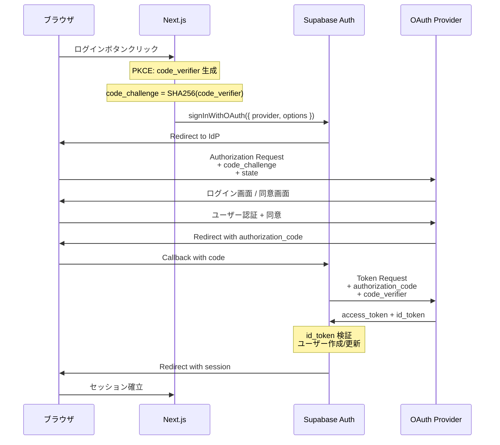

# OAuth 2.0 / OIDC フロー設計

## 概要

OAuth 2.0 と OpenID Connect（OIDC）を使ったソーシャルログインおよび外部 IdP 連携の設計。Supabase Auth をリライングパーティとして、Google / GitHub 等の外部プロバイダと統合する。

## Why OAuth 2.0 + PKCE を選んだか

- **Authorization Code Flow + PKCE** を採用（Implicit Flow は非推奨）
- SPA / モバイルアプリでもセキュアにトークンを取得可能
- Supabase Auth が PKCE をネイティブサポートしており、追加実装不要

## サポートする OAuth プロバイダ

| プロバイダ | 用途 | スコープ |
|-----------|------|---------|
| Google | 一般ユーザーのサインイン | `openid`, `email`, `profile` |
| GitHub | 開発者向けサインイン | `read:user`, `user:email` |

## フロー詳細

### Authorization Code Flow + PKCE



### トークンの構造

Supabase Auth が発行する JWT の構造:

```json
{
  "aud": "authenticated",
  "exp": 1700000000,
  "iat": 1699999100,
  "iss": "https://your-project.supabase.co/auth/v1",
  "sub": "user-uuid-here",
  "email": "user@example.com",
  "role": "authenticated",
  "app_metadata": {
    "provider": "google",
    "tenant_id": "tenant-001"
  },
  "user_metadata": {
    "full_name": "Demo User",
    "avatar_url": "https://example.com/avatar.png"
  }
}
```

## OIDC ディスカバリ

Supabase は `.well-known/openid-configuration` エンドポイントを提供:

```
GET https://your-project.supabase.co/auth/v1/.well-known/openid-configuration
```

これにより JWKS エンドポイントを動的に取得し、JWT の署名検証に使用する。

## セキュリティ対策

### state パラメータ（CSRF 対策）

```
state = base64url(random_bytes(32))
```

- 認可リクエストに含め、コールバック時に検証
- Supabase Auth が自動的に管理

### nonce（リプレイ攻撃対策）

- OIDC の `id_token` に nonce を含め、セッションとの紐付けを検証
- Supabase Auth の PKCE フローで自動処理

### Redirect URI の厳格な管理

Supabase Dashboard で許可する Redirect URI を明示的に登録:

```
# 本番
https://app.example.com/auth/callback

# 開発
http://localhost:3000/auth/callback
```

ワイルドカードは使用しない（オープンリダイレクト攻撃を防止）。

## アカウントリンキング

同一メールアドレスで複数の OAuth プロバイダからサインインした場合:

1. Supabase Auth はメールアドレスベースでアカウントを自動マージ
2. `app_metadata.providers` に利用プロバイダ一覧を保持
3. ユーザーは任意のプロバイダでサインイン可能
