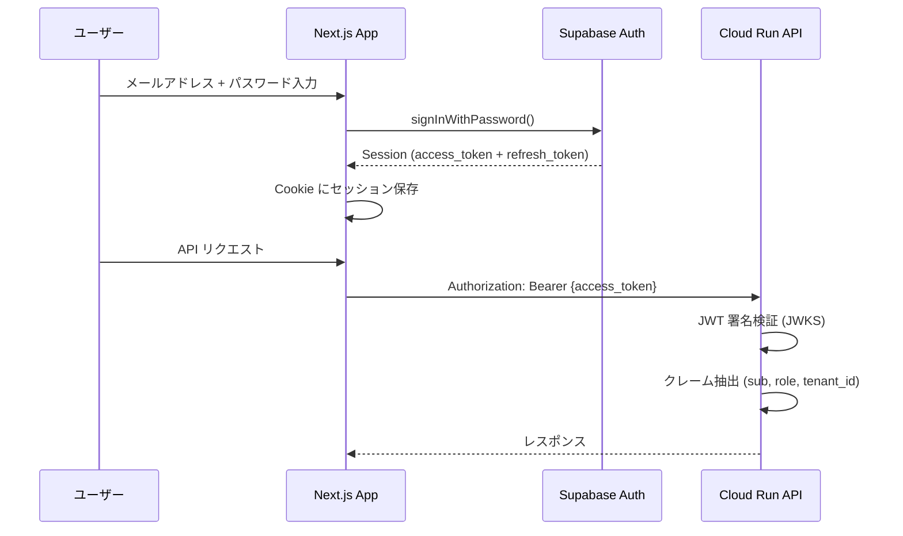
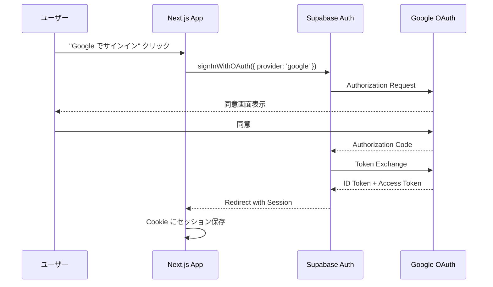
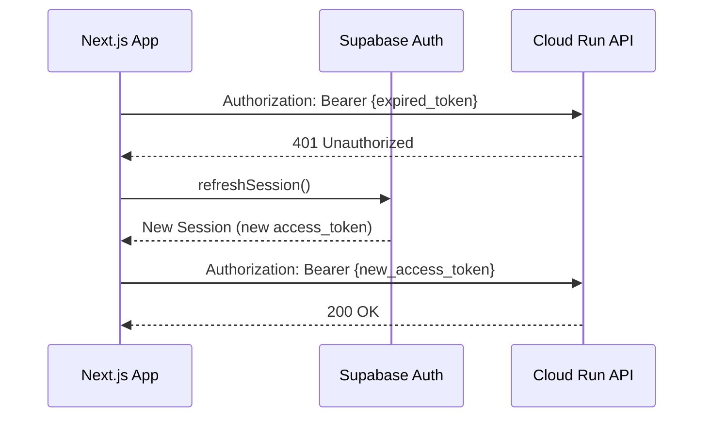

# Supabase Auth 統合パターン

## 概要

Supabase Auth を BaaS（Backend as a Service）の認証基盤として採用し、フロントエンド（Next.js）とバックエンド（Cloud Run）の両方で統一的な認証を実現する設計。

## Why Supabase Auth を選んだか

- **JWT ベース**: ステートレスなトークン検証が可能で、Cloud Run のスケールアウトと相性が良い
- **OAuth プロバイダ統合**: Google, GitHub 等の外部 IdP を数行の設定で追加可能
- **RLS との統合**: `auth.uid()` を使って DB レベルでアクセス制御ができる
- **コスト**: 月間 50,000 MAU まで無料枠で対応可能

## 認証フロー

### サインアップ / サインイン



### OAuth フロー（Google Sign-In）



### トークンリフレッシュ



## 実装パターン

### フロントエンド（Next.js Server Component）

```typescript
// middleware.ts - Next.js Middleware でセッション管理
import { createServerClient } from '@supabase/ssr'
import { NextResponse, type NextRequest } from 'next/server'

export async function middleware(request: NextRequest) {
  const response = NextResponse.next()

  const supabase = createServerClient(
    process.env.NEXT_PUBLIC_SUPABASE_URL!,
    process.env.NEXT_PUBLIC_SUPABASE_ANON_KEY!,
    {
      cookies: {
        getAll: () => request.cookies.getAll(),
        setAll: (cookies) => {
          cookies.forEach(({ name, value, options }) => {
            response.cookies.set(name, value, options)
          })
        },
      },
    }
  )

  // セッションのリフレッシュ（期限切れ対策）
  await supabase.auth.getUser()

  return response
}
```

### バックエンド（JWT 検証）

バックエンドでの JWT 検証は [src/middleware/auth.ts](../src/middleware/auth.ts) を参照。

## セキュリティ考慮事項

| 項目 | 対策 |
|------|------|
| XSS によるトークン窃取 | Cookie (httpOnly, secure, sameSite) でセッション管理 |
| CSRF | SameSite=Lax + Supabase の PKCE フロー |
| トークン漏洩 | access_token の有効期限を短く（15分）、refresh_token でローテーション |
| ブルートフォース | Supabase のレート制限 + カスタムレート制限ミドルウェア |
