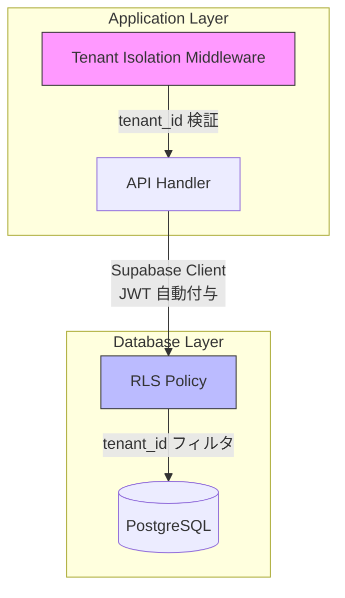

# マルチテナント分離戦略

## 概要

SaaS アプリケーションにおけるテナント間のデータ分離を、PostgreSQL の Row Level Security（RLS）とアプリケーション層の二重チェックで実現する設計。

## Why RLS ベースのテナント分離を選んだか

- **共有 DB + RLS モデル**: テナントごとに DB を分ける方式はコストが高く、小〜中規模 SaaS には過剰。共有 DB + RLS で論理的に分離することで、運用コストを抑えつつセキュリティを確保
- **Supabase との親和性**: Supabase は RLS をファーストクラスでサポートしており、`auth.jwt()` 関数で JWT クレームを直接参照可能
- **Defense in Depth**: アプリケーション層（ミドルウェア）と DB 層（RLS）の二重チェックにより、どちらかに漏れがあっても安全

## テナント分離アーキテクチャ



## テナント ID の伝播

### 1. JWT にテナント ID を埋め込み

```json
{
  "sub": "user-uuid",
  "app_metadata": {
    "tenant_id": "tenant-001",
    "app_role": "user"
  }
}
```

### 2. ミドルウェアでテナント ID を抽出・検証

```typescript
// リクエストコンテキストにテナント ID を設定
const tenantId = jwt.app_metadata.tenant_id;
c.set('tenantId', tenantId);
```

### 3. DB クエリに自動適用（RLS）

```sql
-- 全テーブルに適用する基本ポリシー
CREATE POLICY "tenant_isolation" ON items
  FOR ALL
  USING (
    tenant_id = (auth.jwt() -> 'app_metadata' ->> 'tenant_id')::text
  );
```

## テーブル設計

全てのテナント固有テーブルに `tenant_id` カラムを追加:

```sql
CREATE TABLE items (
    id UUID PRIMARY KEY DEFAULT gen_random_uuid(),
    tenant_id TEXT NOT NULL,
    title TEXT NOT NULL,
    created_by UUID NOT NULL REFERENCES auth.users(id),
    created_at TIMESTAMPTZ NOT NULL DEFAULT now(),
    updated_at TIMESTAMPTZ NOT NULL DEFAULT now()
);

-- tenant_id にインデックスを作成（クエリ性能の確保）
CREATE INDEX idx_items_tenant_id ON items(tenant_id);

-- RLS を有効化
ALTER TABLE items ENABLE ROW LEVEL SECURITY;
```

## RLS ポリシー設計

### 基本ポリシー（全テナント共通）

```sql
-- SELECT: 自テナントのデータのみ閲覧可能
CREATE POLICY "tenant_select" ON items
  FOR SELECT
  USING (
    tenant_id = (auth.jwt() -> 'app_metadata' ->> 'tenant_id')::text
  );

-- INSERT: 自テナントにのみデータ作成可能
CREATE POLICY "tenant_insert" ON items
  FOR INSERT
  WITH CHECK (
    tenant_id = (auth.jwt() -> 'app_metadata' ->> 'tenant_id')::text
  );

-- UPDATE: 自テナントのデータのみ更新可能
CREATE POLICY "tenant_update" ON items
  FOR UPDATE
  USING (
    tenant_id = (auth.jwt() -> 'app_metadata' ->> 'tenant_id')::text
  );

-- DELETE: 自テナントのデータのみ削除可能
CREATE POLICY "tenant_delete" ON items
  FOR DELETE
  USING (
    tenant_id = (auth.jwt() -> 'app_metadata' ->> 'tenant_id')::text
  );
```

### Admin 用バイパスポリシー

```sql
-- admin ロールはテナント横断でアクセス可能
CREATE POLICY "admin_bypass" ON items
  FOR ALL
  USING (
    (auth.jwt() -> 'app_metadata' ->> 'app_role') = 'admin'
  );
```

## テナント横断攻撃への対策

| 攻撃ベクトル | 対策 |
|-------------|------|
| JWT の tenant_id 改ざん | JWT 署名検証で防止 |
| API パラメータでの tenant_id 上書き | ミドルウェアで JWT の tenant_id を強制使用 |
| SQL インジェクションによる RLS 回避 | Supabase クライアントのパラメータ化クエリ |
| サービスキーの漏洩 | サービスキーは Cloud Run の Secret Manager で管理 |
| バッチ処理での漏洩 | バッチ処理用のサービスロールは特定テナントに制限 |

## 実装

アプリケーション層のテナント分離は [src/policies/tenant-isolation.ts](../src/policies/tenant-isolation.ts) を参照。
